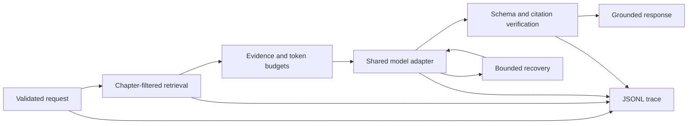

# Reliable AI Agent Lab

A local-first Python workbench for building AI agents that are grounded,
auditable, recoverable, and constrained.

The project combines four reliability patterns in one FastAPI application:

- **Grounded question answering** over a chapter-filtered vector index
- **Human-approved tools** with canonical payloads and idempotent writes
- **Resilient model execution** with bounded retries and structured traces
- **Constrained repair** with an allowlist, immutable checks, and a sandbox

The browser workbench makes each capability visible without requiring a
frontend build. A deterministic stub mode is included, so reviewers can inspect
the control flow, safeguards, traces, and test suite without an API key. Live
answer quality and model-selected tool use are optional checks that require
separate model credentials.

## Quick start

Requirements:

- macOS or Linux
- Python **3.11, 3.12, or 3.13**
- Internet access on the first run to install dependencies, download the
  public-domain corpus, and cache the local embedding model

From the repository root:

```bash
./scripts/run_local.sh
```

On its first run, the script creates `.venv`, installs pinned dependencies,
downloads and fingerprints the corpus, builds the Chroma index, and starts the
application. Later runs reuse those local artifacts.

Open:

- Workbench: [http://127.0.0.1:8000/dashboard](http://127.0.0.1:8000/dashboard)
- API documentation: [http://127.0.0.1:8000/docs](http://127.0.0.1:8000/docs)

To prepare everything without starting the server:

```bash
./scripts/setup_local.sh
```

### Manual setup

```bash
python3.13 -m venv .venv
source .venv/bin/activate
pip install -r requirements.txt
python -m ingest.build
python -m uvicorn app.main:app --reload --port 8000
```

The build is idempotent. The downloaded PDF, extracted pages, chunks, vector
index, traces, generated guides, and `.env` are intentionally excluded from
Git.

## Suggested reviewer path

If you are reviewing the project for the first time:

1. Run `./scripts/run_local.sh` and open the workbench.
2. Try a guided question in the default deterministic stub mode.
3. Inspect the generated trace to see retrieval, limits, model calls, and
   validation as separate events.
4. Run `.venv/bin/python scripts/acceptance_gate.py` to verify the complete
   deterministic suite.
5. Optionally configure a model API key and repeat the acceptance gate with
   `--live` to assess real answer quality, tool selection, and repair behavior.

Stub mode verifies the application-controlled behavior. It does not claim that
a real model will produce a high-quality answer. The optional live gate exists
to test that separate concern.

## Model configuration

### Default: deterministic stub mode

No credentials are required. Leave `OPENAI_API_KEY` empty and the application
uses its deterministic adapter. Stub responses are clearly labelled in API
metrics and in the workbench.

This mode is suitable for reviewing:

- retrieval and chapter-boundary enforcement,
- citation and schema validation,
- approval and idempotency controls,
- retry and recovery decisions,
- trace structure and the constrained repair sandbox.

### Optional: live OpenAI testing

To test with an actual OpenAI model, copy the example configuration:

```bash
cp .env.example .env
```

Open `.env` and replace the empty API key with your own:

```dotenv
OPENAI_BASE_URL=https://api.openai.com/v1
OPENAI_API_KEY=your-openai-api-key
MODEL_NAME=gpt-4.1-mini
```

`MODEL_NAME` is an example. Use a model available to your account that supports
Chat Completions, JSON Schema structured output, and tool/function calling.
The adapter also supports compatible gateways by changing `OPENAI_BASE_URL`
and `MODEL_NAME`.

`./scripts/run_local.sh` automatically loads `.env`. If you start Uvicorn
manually or run the live acceptance gate, load it into the shell first:

```bash
set -a
source .env
set +a
```

Then either start the application:

```bash
.venv/bin/python -m uvicorn app.main:app --reload --port 8000
```

or run all deterministic checks followed by the live workflows:

```bash
.venv/bin/python scripts/acceptance_gate.py --live
```

The live gate covers grounded answers, the guide/tool/approval workflow, and
the repair workflow. It runs in-process, so the web server does not need to be
running. A summary is written to the gitignored
`checks/acceptance_summary.json`.

Keep `.env` local and never commit or paste a real API key into source files,
commands, screenshots, issues, or traces. `.env` is ignored by Git, and the
trace writer refuses events containing the current key value.

Live tests send requests to the configured provider and may incur charges.
Review your provider's current pricing and usage limits first. The local
corpus, embedding model, Chroma index, stub checks, and unit tests do not
require paid model calls.

## Guided examples

The corpus is *Moby-Dick; or, The Whale* by Herman Melville. After setup, try:

- “Who is Ishmael, and why does he decide to go to sea?” through chapter 5
- “How do Ishmael and Queequeg first meet?” through chapter 4
- “What does Father Mapple teach in his sermon?” through chapter 10
- “What warning does Elijah give about the Pequod?” through chapter 20

The `max_chapter` boundary is inclusive. Retrieval is filtered in Chroma and
then checked again in Python, so evidence from later chapters cannot leak into
the response.

### API flow

Grounded answer:

```bash
curl -s http://127.0.0.1:8000/answer \
  -H 'content-type: application/json' \
  -d '{
    "request_id": "demo_answer_01",
    "question": "Why does Ishmael decide to go to sea?",
    "max_chapter": 5
  }'
```

Guide proposal:

```bash
curl -s http://127.0.0.1:8000/guide \
  -H 'content-type: application/json' \
  -d '{
    "request_id": "demo_guide_01",
    "goal": "Create a short cited guide to Ishmael and Queequeg meeting.",
    "max_chapter": 5
  }'
```

`/guide` can return a `pending_approval` operation. Only a separate
application-controlled `/approve` request can authorize the write:

```bash
curl -s http://127.0.0.1:8000/approve \
  -H 'content-type: application/json' \
  -d '{"operation_id":"OPERATION_ID","approve":true}'
```

The approval ledger is intentionally in memory for this local demonstration.
Restarting the server clears pending operations and replay history.

## Reliability design

### 1. Grounded retrieval and authoritative citations

The answer route:

1. validates the request before model or embedding work,
2. filters retrieval by the inclusive chapter boundary,
3. applies a second Python chapter guard,
4. enforces evidence and total-context token budgets,
5. requests a strict structured response,
6. verifies every citation against retrieved metadata and verbatim text,
7. retries once with concrete correction feedback, then fails closed.

An `answered` response requires citations and an inline citation on every
substantive sentence. Invalid or unsupported output becomes
`insufficient_evidence`; it is never passed through as a successful answer.

### 2. Human approval and idempotency

The guide workflow exposes read-only search/fetch tools and a proposal-only
`save_guide` tool. The model cannot call the approval endpoint. Canonical JSON
hashes protect the pending payload, and repeated approval returns the original
artifact instead of writing twice.

### 3. Bounded fault recovery

The shared adapter handles:

- transient rate limiting with `Retry-After` or deterministic backoff,
- context-length errors with evidence reduction and one retry,
- malformed structured output with one corrective call,
- authentication/configuration failures without retry,
- global call, sleep, elapsed-time, and evidence budgets.

Every decision is written as a structured JSONL trace.

### 4. Constrained repair

The repair loop can modify only `repair/select_chunks.py`. It runs one fixed
check command with:

- `shell=False`,
- a finite timeout,
- a minimal environment with model credentials removed,
- SHA-256 verification of the immutable checker before and after every run,
- bounded attempts and fail-closed patch validation.

## Architecture

```text
app/        FastAPI routes, schemas, prompts, approval ledger, tools
adapter/    model boundary, limits, token counting, recovery recipes
ingest/     corpus download, extraction, chapter map, chunks, Chroma index
traces/     canonical JSONL trace schema and writer
repair/     constrained repair loop and sandbox
checks/     executable deterministic capability checks
tests/      unit, integration, invariant, and failure-path tests
templates/  local browser workbench
evidence/   sanitized example traces
scripts/    setup, diagnostics, and evidence utilities
```

The main request flow is:



## Verification

### Deterministic verification (no API key)

Run the layered acceptance gate:

```bash
.venv/bin/python scripts/acceptance_gate.py
```

This runs the deterministic capability checks, the full pytest suite, and the
clean-clone evidence validation with `OPENAI_*` variables deliberately removed.
It cannot spend model credits.

The individual commands are also available:

```bash
.venv/bin/python -m checks.run_all
.venv/bin/python -m pytest -q
.venv/bin/python -m checks.diagnostics
```

### Optional live verification (API key required)

After configuring and loading `.env` as described in
[Model configuration](#model-configuration):

```bash
.venv/bin/python scripts/acceptance_gate.py --live
```

The gate always completes deterministic verification first. It then runs the
live answer, guide, and repair workflows. If `OPENAI_API_KEY` is missing, it
stops with an explicit configuration error instead of silently falling back to
stub results.

## Corpus and attribution

- **Title:** *Moby-Dick; or, The Whale*
- **Author:** Herman Melville
- **Text status:** public domain in the United States
- **Edition:** GITenberg/Project Gutenberg-derived PDF archived by the
  Internet Archive
- **Source:** <https://ia802804.us.archive.org/5/items/MobyDickGit/Moby-Dick.pdf>
- **Pinned SHA-256:** `dae176d68d290b954040b819ac84f3901b8fdb308523a7325fddd91b99d79dad`

The source PDF states that the text is public domain. Its cover artwork is
licensed separately under CC BY-NC 4.0; the application extracts text only and
does not display or redistribute the cover. Check the public-domain status
applicable in your jurisdiction before redistributing corpus artifacts.

The source PDF itself and derived full text are not committed. A fresh clone
reproduces them with `python -m ingest.build`, verifies the pinned checksum,
and records page count and cleaned word count in `corpus/manifest.json`.

## Known limitations

- The local approval ledger is not durable across restarts.
- The local Chroma index is single-machine storage.
- Stub mode demonstrates control flow and traceability, not answer quality.
- Live verification depends on the selected model's structured-output and
  tool-calling behavior and has not been pre-run for another reviewer's key.
- The first embedding-model load is slower because it populates a local cache.
- The application is intended for local exploration, not an unauthenticated
  public deployment.

## Licence

The application source is available under the [MIT License](LICENSE). The
public-domain corpus and its separately licensed cover are described in
[Corpus and attribution](#corpus-and-attribution).
